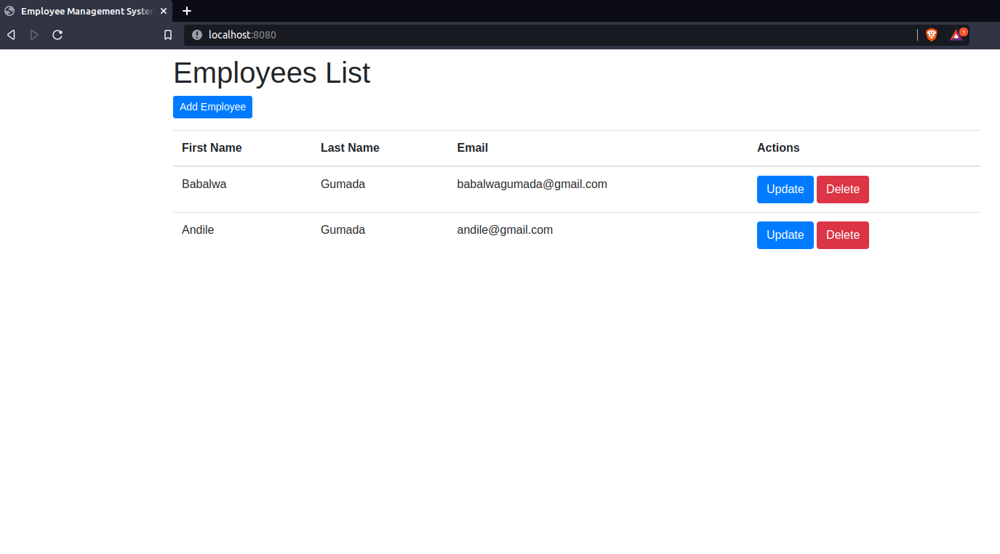
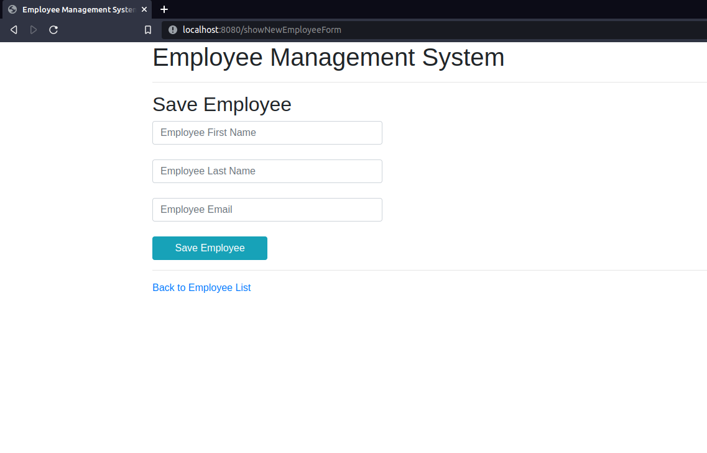
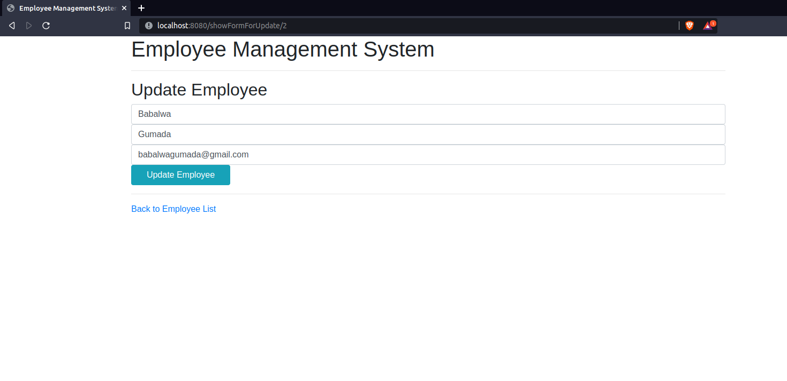

# Requirements
```
1.Java - 8 +
2.Maven - 3.x.x
3.Mysql - 5.x.x
4.Bootstrap - 4.CDN.x.x
5.Tymeleaf
6.JPA
7.Hibernate
```
# Steps to Setup
1. Clone the application

```
git clone https://github.com/AndileGumada1/spring-boot-mvc-with-thymeleaf.git

```
2. Create Mysql database

```
create database expensetracker
```
3. Change mysql username and password as per your installation
```
open src/main/resources/application.properties


change spring.datasource.username and spring.datasource.password as per your mysql installation
```
4. Build and run the app using maven (spring-boot-mvc-thymeleaf)

ListEmployee

SaveEmployee

UpdateEmployee

```
mvn package
java -jar target/spring-boot-mvc-thymeleaf.jar
Alternatively, you can run the app without packaging it using -

mvn spring-boot:run
The app will start running at http://localhost:8080.

```
# Explore Rest APIs
```
The app defines following CRUD APIs.

GET /

POST /saveEmployee

GET /deleteEployee/{id}

GET /showFormForUpdate/{id}

GET /showNewForm
```